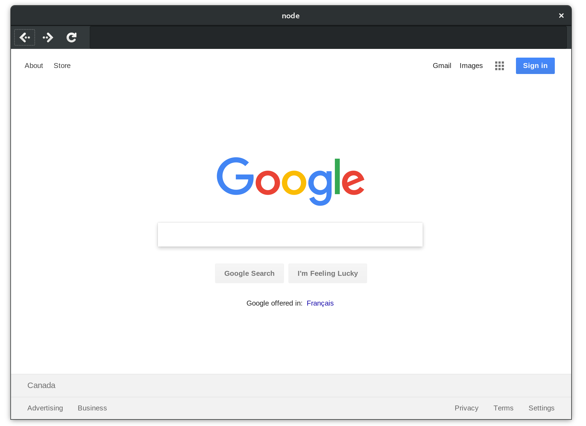
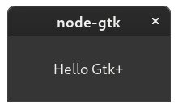

<p align="center">
    <a>
      
    </a>
</p>

# node-gtk

### GNOME Gtk+ bindings for NodeJS


[](https://packagephobia.now.sh/result?p=node-gtk)

### What is this ?

A work in progress to bring Gtk+ usable directly from NodeJS so that the environment would be more updated and supported than the one available via [GJS](https://wiki.gnome.org/action/show/Projects/Gjs).
It uses the [GObject Introspection](https://gi.readthedocs.io/en/latest) library (as [PyGObject](https://pygobject.readthedocs.io), for example), so any `gobject-introspectable` library is supported.

Please note this project is currently in a _beta_ state and is being developed. Any contributors willing to help
will be welcomed.

Supported Node.js versions: **10**, **12**, **13**, **14**, **15**  
Pre-built binaries available for: **Linux**, **OS X**

### How do I use it ?

You can use [Gtk+ API](https://developer.gnome.org/gtk3/stable) directly, or you can use [react-gtk](https://github.com/codejamninja/react-gtk) to develop a `node-gtk` application using React.


[Browser demo source](https://github.com/romgrk/node-gtk/blob/master/examples/browser.js)

### Table of contents

- [Example](#example)
- [Documentation](#documentation)
  - [Common pitfalls](#common-pitfalls)
- [Installing and building](#installing-and-building)
  - [Target Platforms (so far)](#target-platforms-so-far)
  - [Requirements](#requirements)
  - [How to build on Ubuntu](#how-to-build-on-ubuntu)
  - [How to build on Fedora](#how-to-build-on-fedora)
  - [How to build on ArchLinux](#how-to-build-on-archlinux)
  - [How to build on OSX](#how-to-build-on-osx)
  - [Experimental platforms](#experimental-platforms)
  - [Testing the project](#testing-the-project)
    - [Browser demo](#browser-demo)
- [Contributing](#contributing)
- [Features that supported](#features-that-are-supported)
- [Support](#support)

## Example

```javascript
const gi = require('node-gtk')
const Gtk = gi.require('Gtk', '3.0')

gi.startLoop()
Gtk.init()

const win = new Gtk.Window()
win.on('destroy', () => Gtk.mainQuit())
win.on('delete-event', () => false)

win.setDefaultSize(200, 80)
win.add(new Gtk.Label({ label: 'Hello Gtk+' }))

win.showAll()
Gtk.main()
```



## Documentation

[Read our documentation here](./doc/api.md)

### Common pitfalls

The bindings are sometimes a bit raw in that they provide you direct access to C functions.
It is very possible for you to cause a segfault by misusing any library. Here are a few common errors.

#### Gtk & Gdk initialization

Call `Gtk.init()` and `Gdk.init()` before using anything from those modules.

#### Trying to get a Gdk display causes a segfault

If you're under X11, you'll need to call `gi.require('GdkX11', 'x.x')`.

## Installing and building

### Target Platforms (so far)

We're planning to serve pre-built binaries to make this project as cross-platform and easy to install
as possible. However, right now we support only **Linux** and experimentally **OSX** but in both targets,
_the project will fallback to build_.

### Requirements

In order to clone, install, and build this project you'll need a working copy of `git`, `nodejs` 8 or higher, `npm`,
`python2`, and either `gcc` 8 (other versions may fail) or `clang`.
In the _not-working-yet_ Windows platform, all dependencies must be available under [MSYS2 shell](https://msys2.github.io).

### How to build on Ubuntu

Be sure `node` is version **10** or higher.

Install basic dependencies.

```sh
# install dependencies
sudo apt-get install \
  build-essential git \
  gobject-introspection \
  libgirepository1.0-dev \
  libcairo2 \
  libcairo2-dev
```

At this point `npm install node-gtk` should already install, fallback and build `node-gtk` without problems.

### How to build on Fedora

Install basic dependencies:

```sh
sudo dnf install \
  @development-tools \
  nodejs \
  gobject-introspection \
  gtk3 \
  cairo
```

After installing of packages, run `npm install node-gtk`.

### How to build on ArchLinux

The following should be the bare minimum to be able to build the project.

```sh
pacman -S --needed \
  base-devel git \
  nodejs npm \
  gtk3 gobject-introspection \
  cairo
```

Feel free to install all `base-devel` utilities.

After installing those packages, `npm install node-gtk` would do.

### How to build on OSX

Assuming you have [brew](http://brew.sh) installed, the following has been successfully tested on El Captain.

```sh
# basic dependencies to build this repo
brew install git node gobject-introspection gtk+3 cairo
```

At this point `npm install node-gtk` should already install, fallback and build `node-gtk` without problems.

### Testing the project

If you'd like to test everything builds and work properly, find a target to clone this project, then run `npm install`.

```sh
# clone and build
git clone https://github.com/romgrk/node-gtk.git
cd node-gtk
npm install

# how to verify from node-gtk folder
./examples/hello-gtk.js
```

If you'll see a little window saying hello that's it: it works!

Please note in OSX the window doesn't automatically open above other windows.
Try <kbd>Cmd</kbd> + <kbd>Tab</kbd> if you don't see it.

#### Browser demo

If you'd like to test `./examples/browser.js` you'll need [WebKit2 GTK+](http://webkitgtk.org/) libary.

- in **Ubuntu**, you can `apt-get install libwebkit2gtk-3.0` (`4.0` works too) and try it out.
- in **Fedora**, you should run `sudo dnf install webkit2gtk3`
- in **ArchLinux**, you can `pacman -S --needed webkitgtk` and try it out.
- in **OSX**, there is no way to run it right now because `webkitgtk` was removed from homebrew

Once installed, you can `./examples/browser.js google.com` or any other page, and you might try the _dark theme_ out too:

```sh
# OSX needs to have the Adwaita theme installed
# brew install adwaita-icon-theme

# Usage: ./examples/browser.js <url> [theme]
./examples/browser.js  google.com  dark
```

### Experimental platforms

Following how to setup the configuration to at least try building this project.

#### How to build on Windows (experimental)

Mandatory dependency is _[Visual Studio Community](https://www.visualstudio.com/en-us/products/visual-studio-community-vs.aspx)_ or _Express_ with a C++ compiler (open a new C++ project and install it via IDE if necessary).

The easiest/tested way to at least try building this repository is within a _MinGW shell_ provided by the [MSYS2 installer](https://msys2.github.io/).

Once VS and its C++ compiler is available and MSYS2 installed, launch the MinGW shell.

```sh
# update the system
# in case of errors, wait for the update to complete
# then close and open again MingW shell
pacman -Syyu --noconfirm

# install git, gtk3 and extra dependencie
pacman -S --needed --noconfirm git mingw-w64-$(uname -m)-{gtk3,gobject-introspection,pkg-config,cairo}

# where to put the repository clone?
# pick your flder or use ~/oss (Open Source Software)
mkdir -p ~/oss/
cd ~/oss

# clone node-gtk there
git clone https://github.com/romgrk/node-gtk
cd node-gtk

# first run might take a while
GYP_MSVS_VERSION=2015 npm install
```

The `GYP_MSVS_VERSION` could be 2010, 2012, 2013 or 2015.
Please verify [which version you should use](https://github.com/nodejs/node-gyp#installation)

#### Possible issue on MinGW shell

In case you are launching the general executable without knowing the correct platform,
the binary path might not be available.

In such case `python` won't be available either, and you can check via `which python` command.

If not found, you need to export the platform related binary path:

```sh
# example for the 32bit version
export PATH="/mingw32/bin:$PATH"
npm run install
```

This should do the trick. You can also check if there is any python at all via `pacman -Qs python`.

Please remember `python2` is the one needed.

#### Known issues building on Windows

Right now there are few gotchas and the build will most likely fail. Please help with a PR if you know how to solve the issue, thank you!

## Contributing

If you'd like to help, we'd be more than happy to have support. To setup your development environment, you can
run `npm run configure`. You can then build the project with `npm run build`.

 - https://developer.gnome.org/gi/stable/index.html
 - https://v8docs.nodesource.com/
 - https://github.com/nodejs/nan#api

Don't hesitate to join our [Discord channel](https://discord.gg/r2VqPUV).

## Contributors

 - [magcius](https://github.com/magcius)
 - [WebReflection](https://github.com/WebReflection)
 - [romgrk](https://github.com/romgrk)
 - [wotzlaff](https://github.com/wotzlaff)
