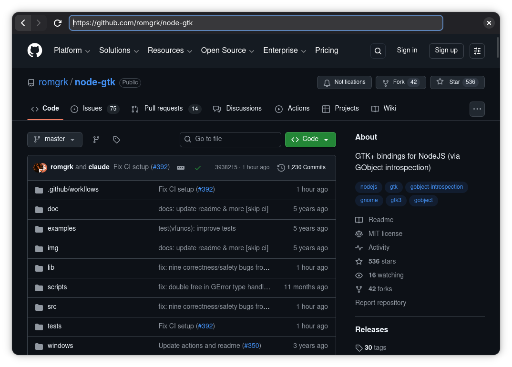
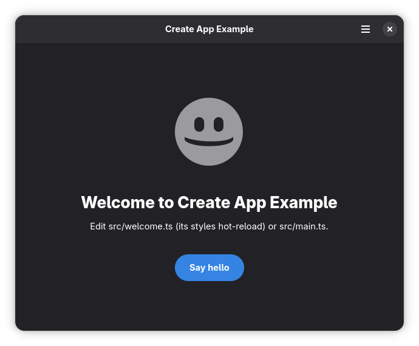

<p align="center">
    <a>
      
    </a>
</p>

<h1 align="center">node-gtk</h1>
<p align="center">
  <b>GTK bindings for NodeJS</b>
  <br/>
</p>

<p align="center">
  <a href="#usage">Usage</a> · <a href="#installing">Installing</a> · <a href="./doc/index.md">Documentation</a> · <a href="#contributing">Contributing</a>
</p>

<br />

`node-gtk` lets you build native GTK apps on **linux**, **macOS** and  **windows**
with full **ESM**, **TypeScript** and **CSS hot-reload** support. Prebuilt binaries 
are available for Node.js versions **20**, **22** and **24**.

<p align="center">
  
</p>

## Usage

The **create** tool generates a complete, ready-to-run GTK/Adwaita project, so you
can start building immediately after [installing GTK4](#installing):

```sh
npx node-gtk create <your-app>
```

<p align="center">
  
</p>

Also see our [hello world](./examples/hello-world.mjs), [web browser](./examples/browser.mjs)
or [system monitor](./examples/system-monitor.mjs) examples.

## Installing

There are two steps:

1. Install `node-gtk` itself (*done by the create tool*)
2. Install the native libraries you use (see examples per platform below)

#### Linux

```sh
# archlinux
pacman -S gtk4 libadwaita

# fedora
dnf install gtk4 libadwaita

# ubuntu
# Already installed :)
```

#### macOS

```sh
brew install gtk4 libadwaita adwaita-icon-theme
```

#### Windows

```sh
# Already installed :)
```

> [!NOTE]
> Windows doesn't have the dependencies we need in a package manager, therefore
> `node-gtk` ships prebuilt versions of GTK 4 / Adwaita, so `npm install node-gtk`
> is all you need **if** your dependency is in our 
> [list of prebuilt libraries](./windows/runtime-libraries.txt).

### build from source

Building from source, or [contributing](./doc/contributing.md)? See [Building from source](./doc/building.md).

## Documentation

[Read our documentation here](./doc/index.md)

## Other notes

`node-gtk` is a [gobject-introspection](https://gi.readthedocs.io/en/latest) library 
for nodejs. It makes it possible to use any introspected C library, such as GTK, 
usable. It is similar in essence to [GJS](https://wiki.gnome.org/action/show/Projects/Gjs) 
or [PyGObject](https://pygobject.readthedocs.io).

[MIT License](./LICENSE)