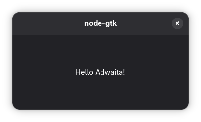
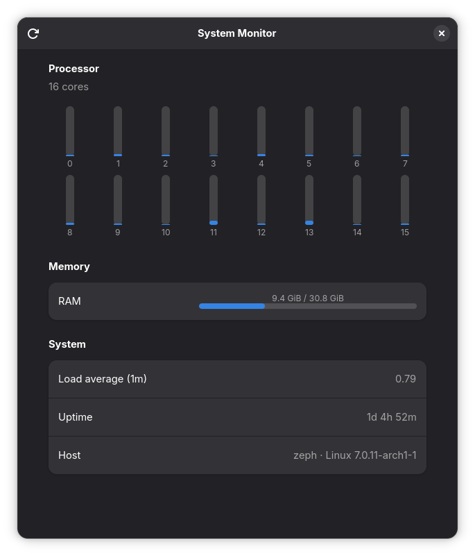

<p align="center">
    <a>
      
    </a>
</p>

<h1 align="center">node-gtk</h1>
<p align="center">
  <b>GTK bindings for NodeJS</b>
  <br/>
  
</p>

`node-gtk` is a [gobject-introspection](https://gi.readthedocs.io/en/latest) library 
for nodejs. It makes it possible to use any introspected C library, such as GTK, 
usable. It is similar in essence to [GJS](https://wiki.gnome.org/action/show/Projects/Gjs) 
or [PyGObject](https://pygobject.readthedocs.io). Please note this project is 
currently in a _alpha_ state.

Supported Node.js versions: **20**, **22**, **24** (other versions may work but are untested)<br>
Supported platforms:
- **Linux** — prebuilt binaries available
- **macOS** — prebuilt binaries available
- **Windows** — prebuilt binaries available (but read [Windows](#windows))


### Table of contents

- [Usage](#usage)
- [ES modules](#es-modules)
- [Documentation](#documentation)
- [TypeScript](#typescript)
- [Installing](#installing)
- [Contributing](#contributing)
- [CommonJS](#commonjs)

## Usage

Below is a [minimal example](./examples/hello-world.mjs) of how to use node-gtk.
Namespaces are imported with the `gi:` scheme; run your app with
`node --import node-gtk/register`:

```sh
node --import node-gtk/register app.mjs
```

```javascript
// app.mjs
import GLib from 'gi:GLib-2.0'   // `gi:Name-Version` (or `gi:Name` for the latest)
import Gtk from 'gi:Gtk-4.0'
import Adw from 'gi:Adw-1'

const loop = GLib.MainLoop.new(null, false)
const app = new Adw.Application('com.github.romgrk.node-gtk.hello', 0)

app.on('activate', () => {
  const content = new Gtk.Box({ orientation: Gtk.Orientation.VERTICAL })
  content.append(new Adw.HeaderBar())
  content.append(new Gtk.Label({ label: 'Hello Adwaita!', vexpand: true }))

  const window = new Adw.ApplicationWindow(app)
  window.setTitle('node-gtk')
  window.setDefaultSize(300, 120)
  window.setContent(content)
  window.on('close-request', () => (loop.quit(), app.quit(), false))
  window.present()

  loop.run()
})

// Under ESM the run call returns immediately; the app keeps running and the
// process exits when the window is closed. See "ES modules" below.
app.run([])
```

> Prefer CommonJS? node-gtk supports it too — see [CommonJS](#commonjs).

<p align="center">
  
</p>

You can also easily create custom applications:

[A web browser (using WebKit2GTK)](./examples/browser.mjs)

<p align="center">
  
</p>

[A system monitor](./examples/system-monitor.mjs)

<p align="center">
  
</p>

## ES modules

ES modules are the default (see [Usage](#usage)). A few specifics:

**The `gi:` import scheme.** `import Gtk from 'gi:Gtk-4.0'` is equivalent to
`gi.require('Gtk', '4.0')` — the default export is the namespace object, so read
members off it (`const { Box, Label } = Gtk`). Use `gi:Name-Version`, or `gi:Name`
for the latest installed version. Static named imports (`import { Box } from
'gi:Gtk-4.0'`) are **not** supported — destructure from the default export.
node-gtk's own API (e.g. `registerClass`) is imported from `node-gtk`
(`import { registerClass } from 'node-gtk'`). The hooks are installed
with `node --import node-gtk/register` and need Node ≥ 20.6.

**The loop integration starts automatically.** The first time you run a main
loop (`GLib.MainLoop.run`, `Gio`/`Gtk.Application.run`, `Gtk.main`), node-gtk
integrates it with Node's event loop for you — there is nothing to call to enable
it.

**Blocking main-loop calls return immediately.** Under ESM, those same run calls
**return immediately** instead of blocking, and **don't return a value** — so make
the run call the last statement and do cleanup/exit from your handler:

```javascript
app.on('activate', () => {
  // ...build the window...
  window.on('close-request', () => (loop.quit(), app.quit(), false))
  window.present()

  loop.run()       // returns immediately under ESM; do cleanup/exit in the handler
})

app.run([])        // not `process.exit(app.run([]))` — the return value is unavailable
```

CommonJS (and signal callbacks) are unaffected. For the why and the design
trade-off, see [#449](https://github.com/romgrk/node-gtk/issues/449).

### Skipping the `--import` flag

The flag is only required for a **static** `import … from 'gi:…'` in the file you
run directly: ESM resolves the whole static graph before any code executes, so the
hooks must be installed first. You can avoid it in a few ways:

```javascript
// 1) Register programmatically, then use dynamic import (no flag):
import 'node-gtk/register'
const Gtk = (await import('gi:Gtk-4.0')).default

// 2) Tiny bootstrap entry — register, then load the real app, which is free to
//    use static `import … from 'gi:…'` (it loads after registration):
import 'node-gtk/register'
await import('./app.mjs')
```

Or move the flag into the environment instead of the command line:
`NODE_OPTIONS="--import node-gtk/register" node app.mjs` (e.g. in an npm script).

## Documentation

[Read our documentation here](./doc/index.md)

## TypeScript

node-gtk can generate TypeScript declarations for the libraries you use,
straight from the GObject-Introspection typelibs installed on your machine — so
the types always match your actual library versions and node-gtk's own runtime
shape (camelCase methods, signal callbacks, nullability, etc.).

```sh
# generates ./node_modules/.node-gtk-types (a hidden, git-ignored cache)
npx node-gtk generate-types Gtk-4.0 Adw-1
```

The command emits one declaration file per namespace (plus the full dependency
closure) and a `node-gtk.d.ts` shim. Point your `tsconfig.json` at it:

```jsonc
{
  "compilerOptions": {
    "moduleResolution": "node16",
    "paths": { "node-gtk": ["./node_modules/.node-gtk-types/node-gtk.d.ts"] }
  }
}
```

Then `gi.require` is fully typed — the namespace is inferred from the string
arguments:

```ts
import * as gi from 'node-gtk'

const Gtk = gi.require('Gtk', '4.0')   // typed as the Gtk-4.0 namespace
const win = new Gtk.ApplicationWindow({ title: 'Hello', defaultWidth: 400 })
win.on('close-request', () => false)   // signal name + callback are typed
```

The [direct `gi:` import form](#direct-imports) is typed too — the generated
shim declares each `gi:<Namespace>-<version>` module, so its default export is the
namespace:

```ts
import Gtk from 'gi:Gtk-4.0'           // typed as the Gtk-4.0 namespace
const win = new Gtk.ApplicationWindow({ title: 'Hello', defaultWidth: 400 })
```

You get typed constructor properties (including inherited and interface ones),
camelCase methods with real return types, GI nullability, typed signal
overloads, enums, `bigint` for 64-bit integers, out-parameters surfaced as the
return value, and cross-namespace types. GNOME's API documentation is included
as JSDoc (with `@param`/`@returns`), so editors show it on hover — this reads the
`.gir` files installed by the libraries' `-dev`/`-devel` packages; pass
`--no-docs` for leaner output if they aren't installed or you don't want them.

Because the output is a generated cache under `node_modules`, add a `postinstall`
script so it regenerates on install:

```json
{ "scripts": { "postinstall": "node-gtk generate-types Gtk-4.0 Adw-1" } }
```

Run `npx node-gtk generate-types --help` for options.

## Installing

1. Install `node-gtk` itself
2. Install the native libraries you use (see examples per platform below)

```sh
npm install node-gtk

# This installs a prebuilt binary when one is available for your platform and
# Node.js version, otherwise it falls back to building from source.
```

#### Linux

```sh
# archlinux
pacman -S gtk4

# ubuntu
apt install libgtk-4-1
```

#### macOS

```sh
brew install gtk4
```

#### Windows

Windows doesn't have the dependencies we need in a package manager, therefore 
`node-gtk` ships prebuilt versions of GTK 4 / Adwaita runtime (DLLs, typelibs, 
icons), so `npm install node-gtk` is all you need **if** your dependency is in 
our [list of prebuilt libraries](./windows/runtime-libraries.txt).

### build from source

Building from source, or contributing? See [Building from source](./doc/building.md).

## Contributing

If you'd like to help, we'd be more than happy to have support. To setup your development environment, you can
run `npm run configure`. You can then build the project with `npm run build`. To generate the `compile_commands.json`
for LSP to work nicely, you can use [bear](https://github.com/rizsotto/Bear) as `bear -- npm run build`.

- https://developer.gnome.org/gi/stable/index.html
- https://v8docs.nodesource.com/
- https://github.com/nodejs/nan#api

## CommonJS

node-gtk works under CommonJS too. Load namespaces with `gi.require(name, version)`
instead of `gi:` imports — the rest of the API is identical, and you run it with
plain `node app.js` (no `--import` flag):

```javascript
const gi = require('node-gtk')
const GLib = gi.require('GLib', '2.0')
const Gtk = gi.require('Gtk', '4.0')
const Adw = gi.require('Adw', '1')

const loop = GLib.MainLoop.new(null, false)
const app = new Adw.Application('com.github.romgrk.node-gtk.hello', 0)

app.on('activate', () => {
  const content = new Gtk.Box({ orientation: Gtk.Orientation.VERTICAL })
  content.append(new Adw.HeaderBar())
  content.append(new Gtk.Label({ label: 'Hello Adwaita!', vexpand: true }))

  const window = new Adw.ApplicationWindow(app)
  window.setContent(content)
  window.on('close-request', () => (loop.quit(), app.quit(), false))
  window.present()

  loop.run()
})

// Unlike ESM, under CommonJS the run call blocks and returns the exit status.
process.exit(app.run([]))
```

The only difference from ESM is module loading and the blocking main-loop
semantics (see [ES modules](#es-modules)).
